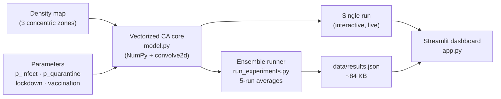

# SEIQR Epidemic Cellular Automaton

[](https://ko-fi.com/ethanbuckley)

A stochastic 2D cellular automaton modelling epidemic spread across a spatially heterogeneous population, extended from a UCL group project into an individually-developed, interactive portfolio piece.

> **Group project credit:** The original SEIQR model and report were produced as a group computing project at UCL. The original simulation code is preserved as [`seiqr.py`](seiqr.py). This repository is an individual extension adding vectorization, a reproducible experiment pipeline, and an interactive Streamlit dashboard. Team members are credited in the original report.

---

## Live Demo

**[Launch the dashboard →](https://your-app-name.streamlit.app)** *(placeholder — update after deployment)*

---

## Architecture



---

## Key Findings (from original report)

**Density gradient vs uniform population**
The density grid produces a lower, earlier infection peak (~210 at t≈45) vs the uniform grid (~300 at t≈60). The low-exposure outer zone acts as a natural brake on transmission.

**Wave-like propagation**
Infection spreads outward from the dense centre in a measurable wave. The centre zone peaks first (34% infected at t≈21), the middle follows (25% at t≈45), and the outer zone peaks last (17% at t≈75).

**Targeted lockdown**
Locking down only the 289-cell centre zone (12% of the grid) produces nearly the same suppression as a whole-grid lockdown — significantly more resource efficient.

**Targeted vaccination**
200 doses concentrated in the centre zone dramatically outperform the same 200 doses distributed uniformly. Uniform distribution gives negligible protection per zone; targeted distribution removes ~55% of susceptible individuals from the transmission engine.

**Combined strategy**
Centre vaccination + centre-only lockdown achieves the best outcome overall, keeping peak infection below 60 during the lockdown window with a small post-lockdown rebound — using fewer resources than the blanket approach.

---

## What's New in This Extension

| Original group project | This individual extension |
|---|---|
| `seiqr.py`: nested Python `for` loops over all 2,500 cells | `model.py`: fully vectorized with `scipy.signal.convolve2d` + NumPy boolean masking |
| ~0.55s per 100-step run | ~0.013s per run — **40× faster** |
| No reproducible experiment script | `run_experiments.py`: all report scenarios in 4.4s, saved to `data/results.json` |
| Console output only | Interactive Streamlit dashboard with live parameter controls and precomputed report figures |

**Planned extensions:** unit tests + CI, network-topology model variant, ABC parameter calibration.

---

## Model Parameters

| Parameter | Value | Description |
|---|---|---|
| Grid size | 50×50 | 2,500 cells total |
| Timesteps | 100 | Simulation duration |
| p_infect | 0.50 | E → I transition probability |
| p_quarantine | 0.10 | I → Q transition probability |
| p_recover_i | 0.05 | I → R transition probability |
| p_recover_q | 0.10 | Q → R transition probability |
| p_expose (centre) | 0.50 | Urban core — 289 cells |
| p_expose (middle) | 0.30 | Suburban ring — 800 cells |
| p_expose (outer) | 0.15 | Rural outskirts — 1,411 cells |
| Vaccine doses | 200 | Applied before simulation starts |
| Vaccine efficacy | 80% | Probability of full immunity per dose |
| Lockdown window | t=10–40 | p_expose reduced to 0.1 in affected zones |
| Runs per scenario | 5 | Stochastic averaging (3 for threshold sweep) |

---

## Tech Stack

| Component | Technology |
|---|---|
| Simulation core | Python, NumPy, SciPy (`convolve2d`) |
| Dashboard | Streamlit, Plotly |
| Experiment runner | NumPy vectorized ensemble |

---

## Project Structure

```
EpidemicCellularAutomata/
├── seiqr.py              # Original group project code (preserved, unmodified)
├── model.py              # Vectorized CA core — individual extension
├── run_experiments.py    # Reproduces all report scenarios, writes data/results.json
├── app.py                # Streamlit dashboard
├── data/
│   └── results.json      # Precomputed ensemble results (~84 KB)
├── requirements.txt      # App dependencies (streamlit, numpy, scipy, plotly)
└── README.md
```

---

## Running Locally

### Dashboard only (reads precomputed results)

```bash
git clone https://github.com/ethanbuckley/EpidemicCellularAutomata.git
cd EpidemicCellularAutomata
pip install -r requirements.txt
streamlit run app.py
```

### Re-run all experiments (regenerates data/results.json)

```bash
pip install numpy scipy matplotlib
python run_experiments.py   # ~4 seconds
streamlit run app.py
```

### Run the original group model

```bash
pip install numpy matplotlib
python seiqr.py
```

---

## Reference

Ghosh, S. and Bhattacharya, S. (2021). Computational Model on COVID-19 Pandemic Using Probabilistic Cellular Automata. *SN Computer Science*, 2(3). doi:10.1007/s42979-021-00619-3

---

## Disclaimer

This project is for educational and research purposes only. The model is a simplified academic exercise and does not constitute public-health advice.

---

## Author

Ethan Buckley, MSci Natural Sciences (Physics and Physical Chemistry), UCL
[ethan.buckley.24@ucl.ac.uk](mailto:ethan.buckley.24@ucl.ac.uk) · [GitHub](https://github.com/ethanbuckley) · [LinkedIn](https://www.linkedin.com/in/ethan-buckley-b7ab6935b/)
