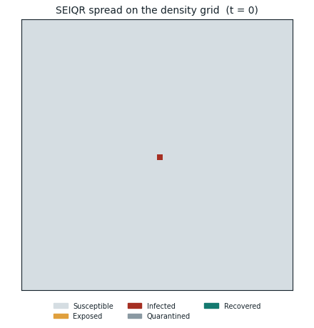
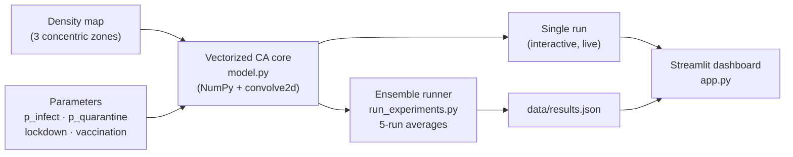

# SEIQR Epidemic Cellular Automaton

[](https://github.com/ethanbuckley/EpidemicCellularAutomata/actions/workflows/ci.yml)
[](https://ko-fi.com/ethanbuckley)

A stochastic 2D cellular automaton modelling epidemic spread across a spatially heterogeneous population, extended from a UCL group project into an individually-developed, interactive portfolio piece.



_Infection (red) spreads as a wave from the dense centre; cells recover (green) behind the front while the low-density outer zone slows the spread. Rendered by [`make_demo_gif.py`](make_demo_gif.py)._

> **Group project credit:** The original SEIQR model and report were produced as a group computing project at UCL. The original simulation code is preserved as [`seiqr.py`](seiqr.py). This repository is an individual extension adding vectorisation, a reproducible experiment pipeline, an interactive Streamlit dashboard, and a validation of the model against the analytical SEIQR ODE. Team members are credited in the original report.

---

## Live Demo

**[Launch the dashboard →](https://epidemiccellularautomata-bhc8wjiiughpqeuljwgzew.streamlit.app)**

---

## Architecture



---

## Key Findings (from original report)

**Density gradient vs uniform population**
The density grid produces a lower, earlier infection peak (~210 at t≈45) vs the uniform grid (~300 at t≈60). The low-exposure outer zone acts as a natural brake on transmission.

**Wave-like propagation**
Infection spreads outward from the dense centre in a measurable wave. The centre zone peaks first (34% infected at t≈21), the middle follows (25% at t≈45), and the outer zone peaks last (17% at t≈75).

**Targeted lockdown**
Locking down only the 289-cell centre zone (12% of the grid) produces nearly the same suppression as a whole-grid lockdown, significantly more resource efficient.

**Targeted vaccination**
200 doses concentrated in the centre zone dramatically outperform the same 200 doses distributed uniformly. Uniform distribution gives negligible protection per zone; targeted distribution removes ~55% of susceptible individuals from the transmission engine.

**Combined strategy**
Centre vaccination + centre-only lockdown achieves the best outcome overall, keeping peak infection below 60 during the lockdown window with a small post-lockdown rebound, using fewer resources than the blanket approach.

---

## Validation against an analytical model

The cellular automaton's local update rules reduce to the classical well-mixed SEIQR compartmental ODE in the mean-field limit. This makes the "checked against the analytical model" claim explicit rather than asserted.

- **Rate mapping.** Each per-timestep probability maps to a continuous ODE rate by `rate = -ln(1 - p)`. The common `rate ≈ p` shortcut is not used, because `p_infect = 0.50` makes it 28% wrong. The single-draw `I→Q` / `I→R` competition maps to a combined exit hazard, split in the ratio `p_quarantine : p_recover_i`.
- **Saturating transmission.** The exposure rule fires on the presence of at least one infected Moore neighbour, so it saturates in the local infected count. Its mean-field force of infection is `λ(i) = -ln(1 - p_expose·(1 - (1 - i)^8))`, which linearises to a frequency-dependent `β = 8·p_expose` at low prevalence and gives a well-mixed basic reproduction number `R₀ = β / (γ_Q + γ_R) ≈ 15` at `p_expose = 0.30`.
- **The result.** Driving the CA by the global infected fraction instead of local neighbours (the well-mixed limit) makes it match the analytical reference. A 20-run ensemble reproduces the exact discrete recursion to about 2% of peak (RMSE) and the continuous ODE's peak height to about 2%, with an essentially identical final attack rate. The continuous ODE peaks a few steps earlier than the discrete CA, a continuous-versus-discrete time effect at this high R₀; the discrete recursion carries no such approximation and is the tight reference.
- **What the spatial model does differently.** The standard local CA departs from the ODE, with a peak roughly 3.5 times lower and about 50 steps later. That departure is the genuine effect of spatial structure and local susceptible depletion, which is the reason for using a cellular automaton in the first place, not a validation failure.

Comparisons use the participating interior of 2,304 cells (the 48×48 grid excluding the permanently-susceptible border), so the CA and ODE share a denominator. The implementation is in [`ode_reference.py`](ode_reference.py) and the overlay figure is in the dashboard's Performance tab.

---

## What's New in This Extension

| Original group project | This individual extension |
|---|---|
| `seiqr.py`: nested Python `for` loops over all 2,500 cells | `model.py`: fully vectorised with `scipy.signal.convolve2d` + NumPy boolean masking |
| ~0.55s per 100-step run | ~0.013s per run, **40× faster** |
| No reproducible experiment script | `run_experiments.py`: all report scenarios in 4.4s, saved to `data/results.json` |
| Console output only | Interactive Streamlit dashboard with live parameter controls and precomputed report figures |
| No analytical validation | `ode_reference.py`: CA validated against the well-mixed SEIQR ODE (see above) |
| No tests or CI | pytest suite plus GitHub Actions running ruff and pytest |
| ~20 hard-coded constants | `config.py`: a single `SimConfig` dataclass with documented defaults |

**Phase 1 (complete):** vectorisation, experiment pipeline, interactive Streamlit dashboard.
**Phase 2 (complete):** analytical ODE validation, pytest suite plus CI, parameter config (`SimConfig`).
**Planned (Phase 3+):** network-topology model variant, ABC parameter calibration.

---

## Model Parameters

| Parameter | Value | Description |
|---|---|---|
| Grid size | 50×50 | 2,500 cells total |
| Timesteps | 100 | Simulation duration |
| p_infect | 0.50 | E → I transition probability |
| p_quarantine | 0.10 | I → Q transition probability |
| p_recover_i | 0.05 | I → R transition probability |
| p_recover_q | 0.10 | Q → R transition probability |
| p_expose (centre) | 0.50 | Urban core, 289 cells |
| p_expose (middle) | 0.30 | Suburban ring, 800 cells |
| p_expose (outer) | 0.15 | Rural outskirts, 1,411 cells |
| Vaccine doses | 200 | Applied before simulation starts |
| Vaccine efficacy | 80% | Probability of full immunity per dose |
| Lockdown window | t=10–40 | p_expose reduced to 0.1 in affected zones |
| Runs per scenario | 5 | Stochastic averaging (3 for threshold sweep) |

---

## Tech Stack

| Component | Technology |
|---|---|
| Simulation core | Python, NumPy, SciPy (`convolve2d`) |
| Dashboard | Streamlit, Plotly |
| Experiment runner | NumPy vectorised ensemble |

---

## Project Structure

```
EpidemicCellularAutomata/
├── seiqr.py              # Original group project code (preserved, unmodified)
├── model.py              # Vectorised CA core (individual extension)
├── ode_reference.py      # Analytical SEIQR ODE and mean-field validation
├── config.py             # SimConfig: tunable model parameters
├── run_experiments.py    # Reproduces all report scenarios, writes data/results.json
├── app.py                # Streamlit dashboard
├── make_demo_gif.py      # Renders the README preview animation
├── tests/                # pytest suite (model core + ODE validation)
├── data/
│   └── results.json      # Precomputed ensemble results
├── assets/
│   └── demo.gif          # README preview animation
├── requirements.txt      # App dependencies (streamlit, numpy, scipy, plotly)
├── requirements-dev.txt  # Dev/CI extras (pytest, ruff, matplotlib)
├── pyproject.toml        # Ruff and pytest configuration
└── README.md
```

---

## Installation

**Prerequisites:** Python 3.10 or newer.

```bash
git clone https://github.com/ethanbuckley/EpidemicCellularAutomata.git
cd EpidemicCellularAutomata
pip install -r requirements.txt        # simulation core + dashboard
pip install -r requirements-dev.txt    # adds pytest and ruff for tests and linting
```

`requirements-dev.txt` already includes everything in `requirements.txt`, so install it on its own if you intend to run the tests.

---

## Running Locally

With the dependencies [installed](#installation):

### Dashboard (reads precomputed results)

```bash
streamlit run app.py
```

### Re-run all experiments (regenerates data/results.json)

```bash
python run_experiments.py   # ~5 seconds, includes the ODE validation
streamlit run app.py
```

### Run the tests

```bash
ruff check .
pytest
```

### Regenerate the demo GIF

```bash
python make_demo_gif.py      # writes assets/demo.gif
```

### Run the original group model

```bash
pip install numpy matplotlib
python seiqr.py
```

---

## Reference

Ghosh, S. and Bhattacharya, S. (2021). Computational Model on COVID-19 Pandemic Using Probabilistic Cellular Automata. *SN Computer Science*, 2(3). doi:10.1007/s42979-021-00619-3

---

## Disclaimer

This project is for educational and research purposes only. The model is a simplified academic exercise and does not constitute public-health advice.

---

## Author

Ethan Buckley, MSci Natural Sciences (Physics and Physical Chemistry), UCL
[ethan.buckley.24@ucl.ac.uk](mailto:ethan.buckley.24@ucl.ac.uk) · [GitHub](https://github.com/ethanbuckley) · [LinkedIn](https://www.linkedin.com/in/ethan-buckley-b7ab6935b/)
